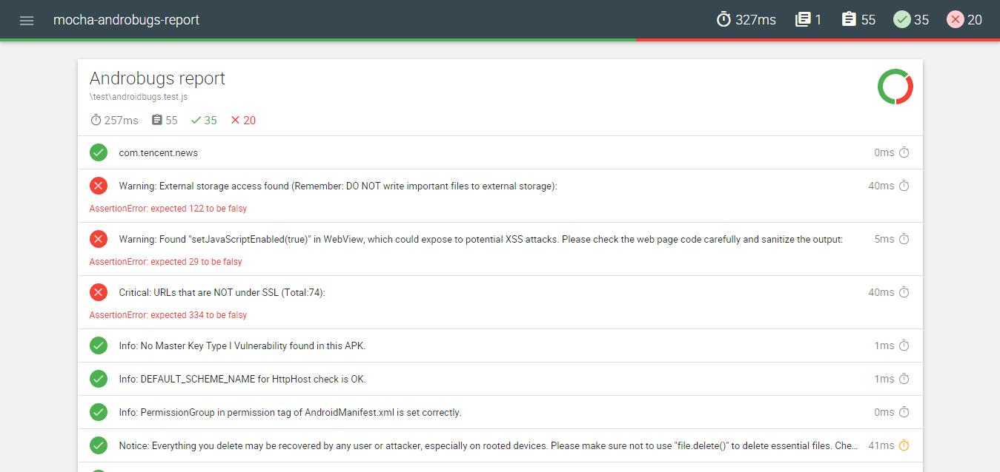

# mocha-androbugs-report
Androbugs mocha report.

# how to use
1. use [AndroBugs_Framework](https://github.com/iqianxing/AndroBugs_Framework.git) to genarate report json file;

2. run mocha command to genarate report.
```
mocha --reporter mochawesome
```

3. Report  

